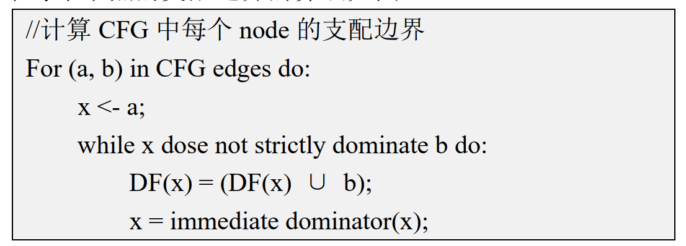
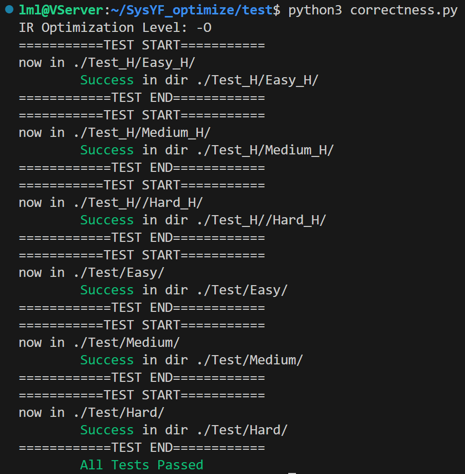
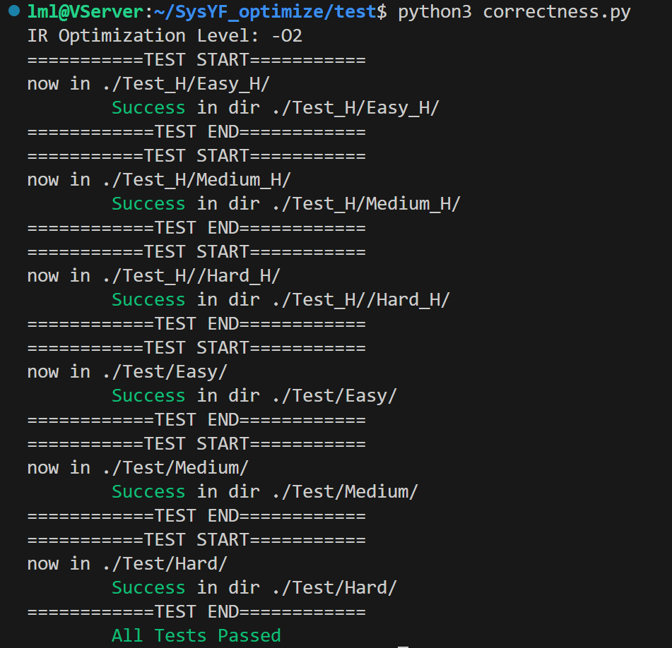
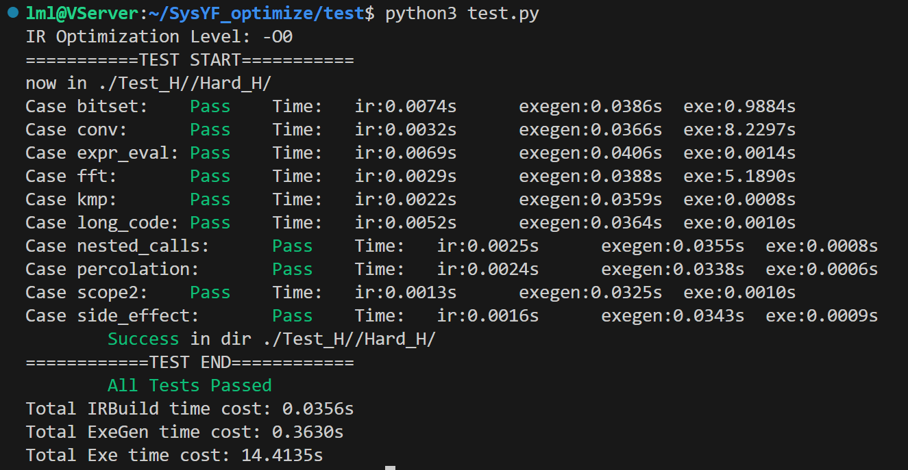
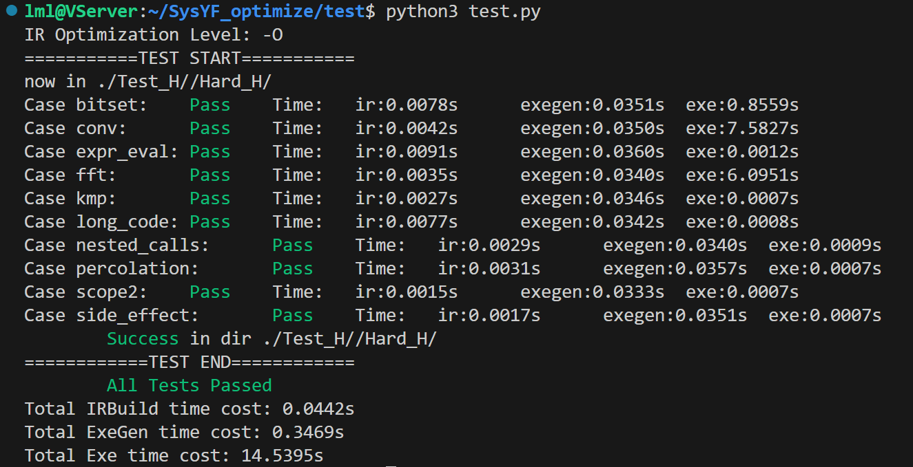
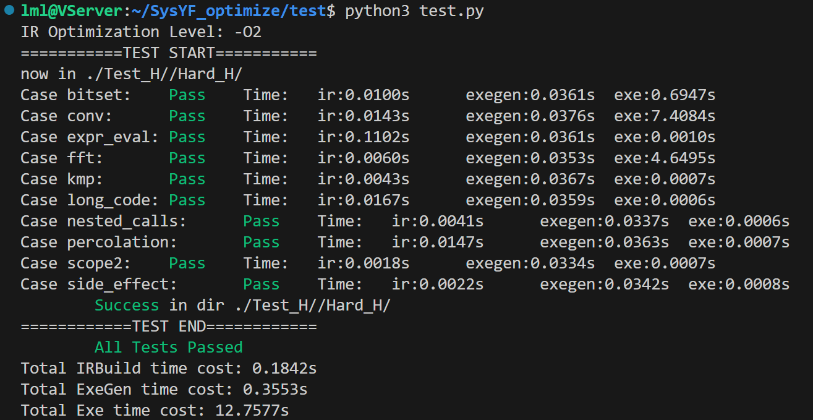
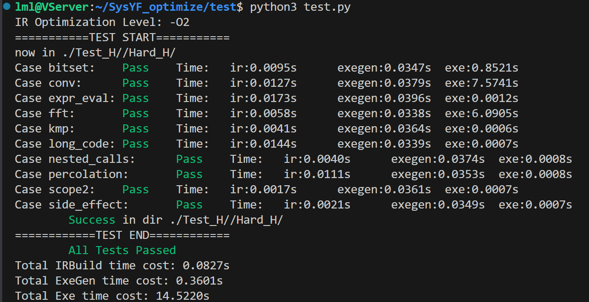
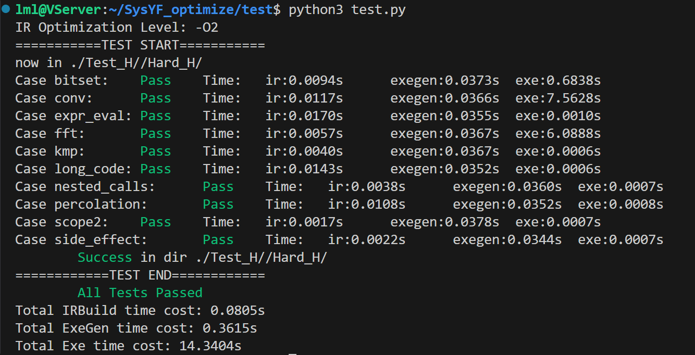
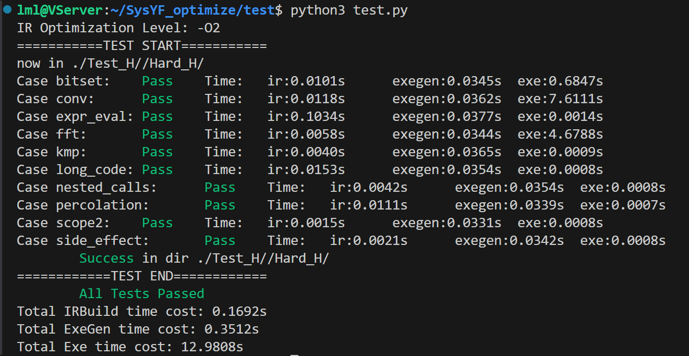

# 基于LLVM的SysYF进阶优化
[TOC]

## 实验选题

基于LLVM在若干方向对SysYF语言生成的LLVM中间代码进行优化，并进一步完成汇编代码的生成和优化。

## 实验设计

基于可行性和工作量的角度考虑，本实验在PW6中间代码生成和去年PW8的实验框架基础上进行，主要分为以下三个步骤：

- 1. 将去年的代码合并入PW6实验框架
- 2. 添加Pass类的派生类，实现对LLVM IR的各种优化
- 3. 实现Arm汇编代码的生成和优化

注：本实验使用的中间代码生成是第六次实验中李牧龙和徐翊然完成的版本，在其基础上做了一些修改（用PW8框架中的代码替换了一部分）。感谢徐翊然同学的付出。

## 组员分工

李牧龙：将去年框架的中间代码优化部分合并入PW6中，完成LLVM IR的优化。

徐航宇：将去年框架的后端部分合并入PW6中，完成Arm汇编代码的生成和优化。

## 贡献比

TODO

## 具体实现

### 合并实验框架

这一部分的工作主要是将代码文件加入文件目录，修改CMakeLists，并将去年代码中的裸指针改为智能指针，总体并不复杂。值得一提的是在此过程中发现了PW6代码框架的一点小问题：

- 1. 创建`PhiInst`时出现段错误：主要是`PhiInst`的`init`函数中未正确设置`parent_`成员变量所致。
- 2. `Value`类的`replace_all_use_with`方法未正确维护use链。

现在这两个问题均已修复。

### 中间代码优化

中间代码优化采用了Mem2Reg、常量折叠与传播、函数性质分析、局部公共子表达式消除、死代码删除、循环表达式外提这几种优化方式。其中Mem2Reg及其依赖的支配树算法是PW8框架中已有的优化，其余优化均在本次实验中完成。另外，为进行后端代码的寄存器分配，还完成了活跃变量分析。

#### 支配树算法

支配树计算是框架中自带的，采用了https://www.cs.rice.edu/~keith/EMBED/dom.pdf中的算法。

该算法是一种数据流分析。对于每个基本块，遍历它的前驱。如果存在一个直接支配节点已经确定的前驱块，就先将当前基本块的直接支配节点设为该前驱；如果在此之后又找到了这样的前驱块，就取这个新前驱块与当前直接支配节点的最近共同支配节点作为支配节点（因为直接支配节点一定支配这一基本块的所有前驱，所有前驱的公共支配节点一定支配这一基本块）。

算法开始时将entry块的直接支配节点设为自己，其余基本块设为空。按逆后序依次计算每个基本块的直接支配节点，直到所有基本块的直接支配节点不再发生改变。

这里按逆后序计算而不用先序的原因是，按逆后序计算可以保证每个节点在计算时，所有前驱已经被计算过。而先序无法保证。

该算法只算出了直接支配节点，但知道直接支配节点后即可沿直接支配节点的链找到所有支配节点。

除支配节点外，后面的Mem2Reg还需用到支配边界。支配边界可以按如下算法计算：


这一部分的完整代码见[DominateTree.h](./include/Optimize/DominateTree.h)和[DominateTree.cpp](./src/Optimize/DominateTree.cpp)。

#### Mem2Reg

Mem2Reg是一种将内存变量转换为寄存器变量的优化。由于LLVM IR是无限寄存器的静态单赋值形式，因此局部的非数组变量都可以被转换为寄存器变量。

这一优化过程不是我们做的（框架带的），源代码中也没有注释，因此下面的解释是我们自己阅读代码的理解。

要进行这一变换，主要需要处理`alloca`, `load`和`store`指令。对于一个变量，如果在一个基本块内有对它的定值（`store`），那该基本块内所有的引用（`load`）都可以被最近的一个定值替换。被替换的`load`可以全部删除，而值被使用过的`store`也可以全部删除。这种情况很容易处理。

然而，对于`load`语句对应的定值来自基本块外的情况就比较复杂。这种情况需要对支配树进行分析。

首先讨论`phi`指令的插入。考虑两个基本块A和B，其中A直接支配B。如果B中`load`了某个变量，而A中有对它的定值，且从A到B的路径上没有再次定值，那么就可以直接用该定值替换B中的`load`的使用。否则，这个`load`对应的定值来自多个基本块，需要添加`phi`指令进行汇合。而对于后一种情况，我们只需要处理每个定值所在基本块的迭代支配边界（这是因为这个定值不会“导致”所在基本块支配的基本块上出现`phi`指令，除此之外它到达的基本块要么在迭代支配边界中，要么被迭代支配边界中的基本块支配（这里注意基本块自身支配自身）），在迭代支配边界的每个基本块开头处为对应变量插入`phi`指令。

然后是对`phi`指令操作数的填充和对引用基本块外定值的`load`语句的替换。从entry块开始dfs，用一个map记录每个变量对应的最新的定值（`phi`或者`store`）。每遍历到一个基本块，就依次遍历其中的指令。对于定值指令（`phi`或`store`），将其加入map中；对于`load`，在map中查找对应的定值，用最新的定值替换，将其删除。然后查找后继中所有的`phi`指令，用对应变量的最新定值和当前基本块作为操作数插入`phi`指令。最后在退出时，弹出map中当前基本块的所有定值。这一步中遇到的`store`也会被删除。

最后移除所有的`alloca`即可。

这一部分的完整代码见[Mem2Reg.h](./include/Optimize/Mem2Reg.h)和[Mem2Reg.cpp](./src/Optimize/Mem2Reg.cpp)。

#### 常量折叠与传播

常量折叠与传播，即将部分操作数全为常量的表达式在编译期间进行计算，并用计算结果直接替代该表达式的使用。尽管在IRBuilder中生成中间代码时，我们已经尽可能地将所有常量表达式直接计算为常量，但Mem2Reg优化后还是会产生大量的常量表达式。这为常量折叠与传播提供了可能。

这一部分的实现思路较为简单。对于操作数全为常量的计算表达式（如四则运算和取模，以及强制类型转换），直接计算出结果，创建相应的常数，并调用`replace_all_use_with`方法替换所有引用即可。

值得一提是对条件br语句的常量折叠。如果条件br语句引用的比较语句为常量表达式，那么可以直接确定br语句的跳转方向，可以将条件br换为无条件的跳转。但在这一替换后，另一个分支的基本块少了一个前驱基本块，可能需要对它的phi指令进行维护，相关代码如下：
```C++
for(auto &inst: del_bb->get_instructions()) {// 删除phi指令中对应前驱块的操作数
    if(!inst->is_phi()) {
        break;
    }
    auto phi = dynamic_pointer_cast<PhiInst>(inst);
    auto ops = phi->get_operands();
    for(int i = 0; i < ops.size(); i+=2) {
        auto op = ops[i];
        auto op_block = dynamic_pointer_cast<BasicBlock>(ops[i+1]);
        if(op_block != block) {
            continue;
        }
        if(phi->get_num_operand() == 4) {// 如果原本就只有两对操作数，那么直接用另一对中的Value替换即可
            Ptr<Value> new_op;
            if(i == 0) {
                new_op = phi->get_operand(2);
            }
            else {
                new_op = phi->get_operand(0);
            }
            phi->replace_all_use_with(new_op);
        }
        else {
            phi->remove_operands(i, i+1);
        }
        break;
    }
}
```

这一部分的完整代码在[ConstCalc.h](./include/Optimize/ConstCalc.h)和[ConstCalc.cpp](./src/Optimize/ConstCalc.cpp)中。

#### 函数性质分析

这一部分主要为分析函数是否为纯函数。

在这一轮优化中，我们的要求比较严格，将纯函数定义为：
- 1. 没有对全局变量的引用；
- 2. 没有传入数组参数；
- 3. 如果有函数调用，则调用的函数必须是纯函数。

理论上，即使传入了数组参数，如果没有对数组进行赋值，那么函数仍然是纯函数（不考虑并行的情况下）。但是这样的函数的运行结果依赖于调用时数组的状态，而数组状态是否改变并不好确定。因此我们将这样的函数视为非纯函数。

满足上面这些性质的函数，执行结果仅由传入的参数决定。这样的函数可以为优化带来很多方便。

分析函数的这种性质也非常简单。
- 首先，对于函数体为空的函数，我们认为是外部函数，稳妥起见视为非纯函数。
- 然后扫描函数的所有参数，如果有数组参数则记录下来。
- 最后扫描函数体中所有的指令。如果有引用全局变量的指令、调用非纯函数的函数调用指令或者对上面记录的数组参数进行赋值的语句，则该函数不是纯函数。
- 没有被上述过程记录为非纯函数的函数即为纯函数。

这一部分的完整代码见[FindPureFunc.h](./include/Optimize/FindPureFunc.h)和[FindPureFunc.cpp](./src/Optimize/FindPureFunc.cpp)。

#### 局部公共子表达式消除

在同一基本块内，如果有两个表达式完全相同，那么就可以去掉后面的表达式，将它的结果替换为前面的表达式的结果。这一优化只能对除`alloca`, `br`, `ret`, `store`, `load`以外的语句进行（因为这些表达式的效果不完全在于返回值，或者返回值不能完全由参数决定。

LLVM IR的静态单赋值特性为这一优化的实现带来了方便。因为每个变量只会被赋值一次，因此在一个基本块内，被引用的值不可能在两个引用它的指令之间被再次定值。因此我们可以只比较操作数是否是同一个对象。

比较表达式是否相同也很简单，只需要依次比较类型、操作数数量，每个操作数是否是同一对象即可。这里有两个例外情况：

其中一个是常数，因为在中间代码生成传入常数时，每一个常数都是新建的不同对象，尽管它们的值可能相同。因此比较操作数时，对常数需要特别处理，比较它们的值是否相同。比较操作数的核心代码如下：
```C++
bool compare_op(Ptr<Value> op1, Ptr<Value> op2) {
    if(op1->get_type()->get_type_id() != op2->get_type()->get_type_id()) {
        return false;
    }
    auto const_int1 = dynamic_pointer_cast<ConstantInt>(op1);
    auto const_int2 = dynamic_pointer_cast<ConstantInt>(op2);
    auto const_float1 = dynamic_pointer_cast<ConstantFloat>(op1);
    auto const_float2 = dynamic_pointer_cast<ConstantFloat>(op2);
    if(const_int1 && const_int2) {
        return const_int1->get_value() == const_int2->get_value();
    }
    else if(const_float1 && const_float2) {
        return const_float1->get_value() == const_float2->get_value();
    }
    else {
        return op1 == op2;
    }
}
```

另一个即为函数调用。如果两个表达式调用了相同的纯函数，且传入的参数相同，那么这两个表达式也是公共子表达式。

这一部分的完整代码见[LocalCSE.h](./include/Optimize/LocalCSE.h)和[LocalCSE.cpp](./src/Optimize/LocalCSE.cpp)。

#### 死代码删除

死代码删除即删除不会被执行/执行结果不会被使用的代码。我们将这一部分分为死指令删除和死基本块删除。

**死指令删除**：

死指令删除仅涉及除`br`, `ret`和`store`外的指令。如果一条指令的use链为空，那么这条指令被视为死指令，可以被删除。对于函数调用指令，则额外要求它调用的必须是纯函数。

这一部分的完整代码见[DCE.h](./include/Optimize/DCE.h)和[DCE.cpp](./src/Optimize/DCE.cpp)。

**死基本块删除**：

可以被删除的死基本块分为两类：一种是从entry开始dfs，没有被访问到的基本块；另一种是只有一个前驱和一个后继，且前驱也只有这一个后继，并且内部没有除`br`外的指令的基本块。

对于第一种情况，只需一遍dfs即可找出需要被删除的基本块，非常简单。关键在于像常量折叠中对`br`的处理一样，这一基本块的后继少了一个前驱，其中的`phi`指令可能需要维护。这一部分的代码与常量折叠中的处理类似，不再赘述。

第二种情况，只需对每个基本块检查它的前驱和后继即可。然而由于后继的前驱发生了变化，因此同样可能需要维护其中的`phi`指令。需要将涉及到的`phi`指令中被删除的基本块替换为它的前驱，这一部分的代码如下：
```C++
for(auto &inst: succ->get_instructions()) {// 后继的前驱发生了改变，需要更新phi
    if(!(inst->is_phi())) {
        break;
    }
    auto phi = std::dynamic_pointer_cast<PhiInst>(inst);
    auto ops = phi->get_operands();
    for(int i = 0; i < phi->get_operands().size(); i+=2) {
        auto op = ops[i];
        auto op_block = std::dynamic_pointer_cast<BasicBlock>(ops[i+1]);
        if(op_block != block) {
            continue;
        }
        phi->set_operand(i+1, prev);// 将block对应的操作数修改为它的前驱即可
        block->remove_use(phi);
    }
}
```

还需注意的是，在每一次删除基本块后，都需正确维护其它基本块的前驱和后继，否则可能毒害后续的基本块删除。

死基本块删除的完整代码见[DBE.h](./include/Optimize/DBE.h)和[DBE.cpp](./src/Optimize/DBE.cpp)。

#### 循环表达式外提

循环表达式外提，即将循环中不依赖于循环变量的表达式提到循环外。这一优化可以减少循环中的计算量，提高效率。要实现这一优化，首先需要找到循环，然后才能判断循环表达式是否依赖于循环变量，并进行外提。

**循环识别**：

循环识别分为以下几步：
- 采用课内讲过的基于回边的算法寻找自然循环。对流图从entry开始dfs，然后对于每一条回边n->d，从n开始沿流图逆向dfs，将经过的基本块全部加入该回边对应的循环中，直到回到d。这样就可以找到所有的自然循环。
- 找出每个自然循环的入口块。这一步只需遍历循环中所有的块，找到支配其他所有节点的块即可。
- 计算循环间的嵌套关系。首先对所有循环按基本块数量升序排序，从最小的循环开始往后遍历，如果当前循环的基本块集合是排在它后面的某个循环的子集，那么它就是这个循环的内层循环。
- 合并循环。有些循环内可能存在多条回边，因此会存在于多个自然循环中，但不应该被当作多个不同循环处理。因此，需要遍历所有的循环，如果存在两个循环的入口块相同，又没有嵌套关系，那么就将这两个循环合并为一个循环。

这一部分的完整代码见[FindLoop.h](./include/Optimize/FindLoop.h)和[FindLoop.cpp](./src/Optimize/FindLoop.cpp)。

**循环表达式外提**：

循环表达式外提的第一步是扫描循环不变表达式。这一部分的思路与前面一些优化Pass类似。首先，循环不变式只考虑除`alloca`, `br`, `load`, `store`, `phi`之外的指令。然后，对于每一条指令，如果它的操作数全部在循环外被定值，且不是全局变量，那么它就是循环不变式。同样，如果是函数调用指令，则额外要求调用的函数是纯函数。

第二步是移动语句。这里分为两种情况：
- 如果循环的入口块的前驱中只有一个基本块在循环外（即外界进入循环只有一条路径），那么直接把循环不变式移动到这一个循环外的基本块内即可。
- 但如果循环入口的前驱中有多个基本块不在循环内，那就需要创建一个新的基本块，将这些不在循环内的基本块连接到这个新的基本块上（同时移除与循环入口块的连接），再将这个新的基本块连接到循环入口块，然后将循环不变式移动到这个新的基本块上。由于这种情况下基本块的结构发生了改变，因此还需要维护其中的`phi`指令，将`phi`指令的操作数分为两部分（拆成两条指令），一部分留在循环入口块，一部分留在新的基本块上，这一部分的核心代码如下：
```C++
PtrVec<Instruction> insts(loop_entry->get_instructions().begin(), loop_entry->get_instructions().end());
for(auto inst : insts) {
    if(!inst->is_phi()) {
        break;
    }
    auto phi = std::dynamic_pointer_cast<PhiInst>(inst);
    std::set<std::pair<Ptr<Value>, Ptr<BasicBlock>>> in_entry, in_pre;
    for(int i = 0; i < phi->get_num_operand(); i+=2) {
        auto op = phi->get_operand(i);
        auto op_block = std::dynamic_pointer_cast<BasicBlock>(phi->get_operand(i+1));
        if(loop->get_blocks().find(op_block) != loop->get_blocks().end()) {// 这一对操作数包含循环内的基本块，留在循环入口
            in_entry.insert({op, op_block});
        }
        else {// 这一对操作数用到了循环外的基本块，应该被移到循环前的新基本块里
            in_pre.insert({op, op_block});
        }
        if(in_entry.empty()) {// 没有用到循环内的基本块，直接移到pre中
            loop_entry->delete_instr(phi);
            loop_pre_bb->add_instr_begin(phi);
        }
        else if(in_pre.size()) {// 既有循环内的基本块，又有循环外的基本块
            if(in_pre.size() == 1) {// 这种情况需要在entry里创建新的phi
                auto new_phi = PhiInst::create_phi(phi->get_type(), loop_entry);
                for(auto pair : in_entry)
                    new_phi->add_phi_pair_operand(pair.first, pair.second);
                new_phi->add_phi_pair_operand(in_pre.begin()->first, in_pre.begin()->second);
                phi->replace_all_use_with(new_phi);
                loop_entry->delete_instr(phi);
                loop_entry->add_instr_begin(new_phi);
            }
            else {// 这种情况需要把原来的phi拆成2部分，一部分在entry里，一部分在pre里
                auto pre_phi = PhiInst::create_phi(phi->get_type(), loop_pre_bb);
                for(auto pair : in_pre) {
                    pre_phi->add_phi_pair_operand(pair.first, pair.second);
                }
                loop_pre_bb->add_instr_begin(pre_phi);
                auto entry_phi = PhiInst::create_phi(phi->get_type(), loop_entry);
                for(auto pair : in_entry) {
                    entry_phi->add_phi_pair_operand(pair.first, pair.second);
                }
                entry_phi->add_phi_pair_operand(pre_phi, loop_pre_bb);
                phi->replace_all_use_with(entry_phi);
                loop_entry->delete_instr(phi);
                loop_entry->add_instr_begin(entry_phi);
            }
        }
    }
}
```

这一部分的完整代码见[LoopCodeMotion.h](./include/Optimize/LoopCodeMotion.h)和[LoopCodeMotion.cpp](./src/Optimize/LoopCodeMotion.cpp)。

#### 活跃变量分析

活跃变量分析大体上按照课内所讲的数据流分析过程进行，但由于涉及到phi指令，需要对数据流方程做一点小修改。

对于phi指令中的操作数对[op, block]，op只在block的出口处是活跃变量，在这条phi指令所在基本块的其他前驱块出口处不是活跃变量。

因此，在扫描所有基本块中的所有指令时，需要使用一个map记录每个基本块中指令用到的操作数在哪些基本块出口可以是活跃变量。对于除了phi指令之外的指令，则每一个操作数在所有前驱基本块出口都可以是活跃变量。

对于数据流方程，计算IN[block]的过程不变，但计算OUT[block]时，对于后继块IN集合中的活跃变量，需要在map中查询它在block出口处是否是活跃变量，如果是，则将它加入OUT[block]。

这一部分的完整代码见[ActiveVar.h](./include/Optimize/ActiveVar.h)和[ActiveVar.cpp](./src/Optimize/ActiveVar.cpp)。

### 后端代码生成与优化

TODO

## 评测结果

### 中间代码优化

对中间代码优化的所有测试均使用clang的后端，优化等级为O0。

#### 正确性

仅开启Mem2Reg优化的测试结果：


开启全部优化的测试结果：


可以看到，采取的优化手段没有对正确性产生影响。

#### 运行时间

为体现优化效果，选择了`test/Test_H/Hard_H`目录下的所有样例进行测试。这一部分样例大多需要较长的运行时间。

测试在CPU为i9 14900k，内存为64GB的机器上进行。操作系统为Ubuntu 22.04.3 LTS。

对`test/Test_H/Hard_H`目录下的所有样例，不开启优化的运行时间：


对`test/Test_H/Hard_H`目录下的所有样例，仅开启Mem2Reg优化的运行时间：


对`test/Test_H/Hard_H`目录下的所有样例，开启全部优化后的运行时间：


如果仅开启Mem2Reg优化，则总的运行时间并无太大变化，甚至略微增加。观察每个样例的运行时间后发现主要是fft样例运行时间增加导致。对于Mem2Reg导致运行时间增加的原因，我们分析生成的中间代码后并未发现明显异常。推测是因为fft样例的大部分操作代价在数组上，因此单纯的Mem2Reg优化并未起到明显的优化效果（Mem2Reg不会影响数组的访问），反而可能因为引入phi指令影响最终的运行效率。但同时Mem2Reg为后续的优化提供了可能（比如产生了大量的新的常量表达式），且后端代码生成也依赖于此，因此我们仍然将其作为优化的基础。

如果开启全部优化，则总的运行时间与前两者相比均有较为明显的减少。这证明对中间代码的优化是有效的。

### 对不同优化Pass效果的测试

下面的所有测试都默认开启了Mem2Reg优化。

仅开启函数性质分析与死代码删除：


仅开启常量折叠与传播、函数性质分析和死代码删除：


开启常量折叠与传播、函数性质分析、局部公共子表达式消除和死代码删除


开启全部优化（在上面的基础上加上循环表达式外提）：


可以看到，每一个优化Pass都有一定效果，且对不同样例而言，优化效果最显著的Pass也不尽相同。比如局部公共子表达式消除在fft样例上的效果最为显著，循环表达式外提在conv样例上最为明显，而常量折叠在bitset样例上起到了良好的效果。死代码删除单独使用时没有产生明显的优化，这是因为正常编写代码时并无太多死代码可供删除，但死代码删除可以使其他优化发挥出效果（其他优化会产生死代码，但不会立刻删除，而是在死代码删除时一并删去）。与此同时，在这些除Mem2Reg外的优化中，并没有观察到进行优化之后运行时间明显下降的现象。

总而言之，每一个优化Pass都是较为有效的，在合适的场景下能发挥出较为明显的效果。